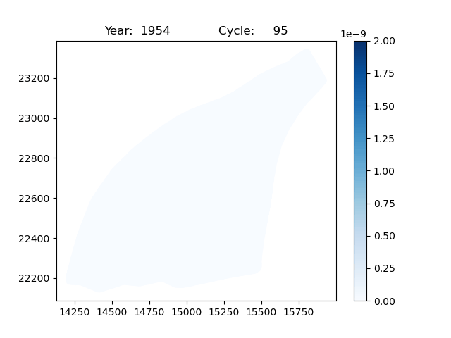

# lbnl-plume-time-series-viz

This tool is used to create a time-series 2D visualization of the a specified element.
The 2D plot is of a single specified layer from the 3D mesh.

## Setting up the environment (recommended)
Although not mandatory, it is recommended to create a virtualenv to predict the outputs of the code.
Use the provided `requirements.yml` file to create the virtual env.

#### To create a new environment, use the following command.
```
conda env create -f requirements.yml
```

#### To update an existing environment, use the following command.
```
conda env update -f requirements.yml
```


## How to run the code?
This code needs as input the following params:
- the directory containing the plot_mesh and plot_data files.
- the layer of interest
- the variable/element of interest

These commands can also be specified in a configuration file. Check [`src/main.cfg`](src/main.cfg).

Use the following command to run the code:
#### Using configuration file
```
python main.py @main.cfg
```


#### Using commandline arguments
```
python main --input_dir path/to/input_dir --layer_number 7 --variables_of_interest variable_name
```

## Sample GIF using a sample simulation output dataset
